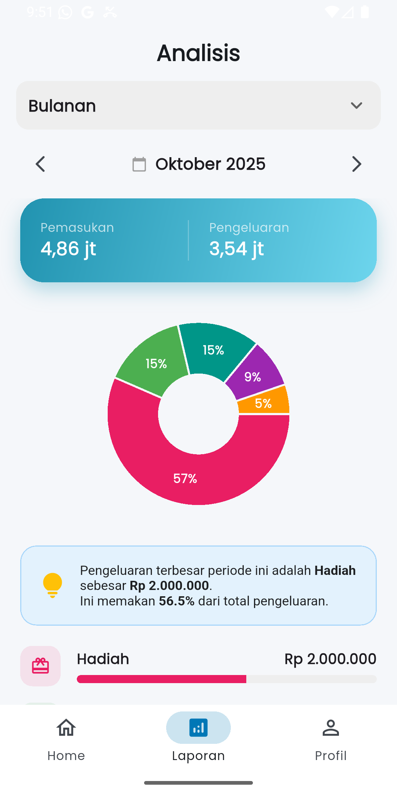

# MoneyTracker 💰


**MoneyTracker** is a comprehensive, offline-first mobile application designed to help users manage their personal finances effectively. Built with **Flutter**, it focuses on data privacy, performance, and intuitive user experience.

> *Calculated finances, controlled future.*

---

## ✨ Key Features

### 1. 🔐 Secure Authentication & Session
- **Hybrid Storage Strategy:** Secure login and registration system.
- **Session Management:** Keeps users logged in using persistent tokens via Shared Preferences.
- **Data Privacy:** User data is isolated locally; User A cannot see User B's transactions.

### 2. 💸 Transaction Management (CRUD)
- **Comprehensive Tracking:** Record Income and Expenses with detailed attributes (Amount, Category, Date, Note).
- **Evidence Attachment:** Attach photo proofs (invoices/receipts) to transactions using camera or gallery.
- **Search & Filter:** Filter transactions by Date Range, Category, or Keyword.

### 3. 📊 Smart Budgeting & Analysis
- **Budget Alerts:** Set monthly limits per category. The app proactively warns users via **Pop-up Alerts** if a new transaction exceeds the budget.
- **Visual Reports:** Interactive **Pie Charts** and financial breakdowns (Daily, Weekly, Monthly) using `fl_chart`.

### 4. ⚙️ Personalization & Utilities
- **Custom Categories:** Users can manage (Add/Edit/Delete) their own expense/income categories with custom icons.
- **Theme Support:** Fully supported **Dark Mode** & Light Mode based on user preference.
- **Admin Tools (Dev Mode):** Special "Seeding" feature for Administrators to generate dummy data for testing purposes (Nov - Present).

---

## 🛠️ Tech Stack & Architecture

This project follows the **MVVM (Model-View-ViewModel)** architectural pattern to ensure code maintainability and separation of concerns.

| Component | Technology / Package | Description |
| :--- | :--- | :--- |
| **Framework** | Flutter (Dart) | Cross-platform UI toolkit. |
| **Local Database** | **sqflite** (SQLite) | Relational database for storing Users, Transactions, and Budgets. |
| **Session Manager** | **shared_preferences** | Lightweight storage for Login Status (`isLoggedIn`) & Theme Settings. |
| **State Management** | `setState` & `ValueNotifier` | Efficient local state handling. |
| **Visualization** | `fl_chart` | Rendering complex financial charts. |
| **Media** | `image_picker` | Handling Camera and Gallery access. |
| **Formatting** | `intl` | Currency (IDR) and Date formatting. |

---

## 📱 App Screenshots

| Home Screen | Report Analysis | Add Transaction | Dark Mode |
|:---:|:---:|:---:|:---:|
| ** | ** | ** | ** |


---

## 🧠 Technical Highlights (Why SQLite + SharedPrefs?)

This application implements a **Hybrid Storage Approach** to optimize performance:

1.  **SQLite (Relational Data):** Used for complex, structured data like *Transactions* and *User Profiles*. This ensures data integrity and allows for complex querying (e.g., "Sum expenses by category for this month").
2.  **SharedPreferences (Key-Value):** Used for lightweight data like *Session Flags* and *App Settings*. This allows the app to perform a quick "Login Check" on the Splash Screen without the overhead of opening a full database connection.

---

## 🚀 How to Run

1.  **Clone the repository**
    ```bash
    git clone [https://github.com/laraagasii/MoneyTracker.git](https://github.com/laraagasii/MoneyTracker.git)
    ```
2.  **Navigate to project directory**
    ```bash
    cd MoneyTracker
    ```
3.  **Install dependencies**
    ```bash
    flutter pub get
    ```
4.  **Run the app**
    ```bash
    flutter run
    ```

---

## 👤 Author

**Hanifah Larama Agasi**
* **Role:** Mobile Application Developer
* **LinkedIn:** www.linkedin.com/in/hanifahlaramaagasi
* **University:** Universitas Andalas

---

*This project was developed as a final project for the Mobile Application Development course, demonstrating proficiency in Flutter, Local Databases, and Logic Implementation.*
